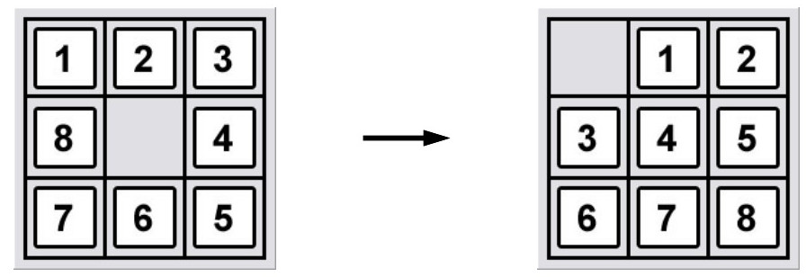

# **<u>L5. Tree Search, Dynamic Programming, Uniform Cost Search</u>**

## Tree search

### Search problem 

- Definition
  - $s_{\text {start }}$ : starting state
  - $\operatorname{Actions} (s)$ : possible actions
  - $\operatorname{Cost}(s, a)$ : action cost
  - $\operatorname{Succ}(s, a)$ : successor
  - $\operatorname{IsEnd} (s)$ : reached end state?

- transportation example (live solution)

### Backtracking search

```pseudocode
def backtrackingSearch(s, path):
	If IsEnd(s): update minimum cost path
	For each action a ∈ Actions(s):
		Extend path with Succ(s, a) and Cost(s, a)
		Call backtrackingSearch(Succ(s, a), path)
	Return minimum cost path
```

### Depth first search

- Assume action costs $\operatorname{Cost}(s, a) = 0$
- Idea: Backtracking search + stop when find the first end state

### Breadth-first search

- Assume action costs $\operatorname{Cost}(s, a) = c$ for some $c \geq 0$
- Idea: Explore all nodes in order of increasing depth

### DFS with iterative deepening

- Assume action costs $\operatorname{Cost}(s, a) = c$ for some $c \geq 0$
- Idea:
  - Modify DFS to stop at a maximum depth. 
  - Call DFS for maximum depths 1, 2, . . . .

### Tree search algorithms

| Algorithm    | Action costs      | Space    | Time     |
| ------------ | ----------------- | -------- | -------- |
| Backtracking | any               | $O(D)$   | $O(b^D)$ |
| DFS          | zero              | $O(D)$   | $O(b^D)$ |
| BFS          | constant $\geq$ 0 | $O(b^d)$ | $O(b^d)$ |
| DFS-ID       | constant $\geq$ 0 | $O(d)$   | $O(b^d)$ |

* Legend: $b$ actions/state, solution depth $d$, maximum depth $D$

## Dynamic Programming


- Minimum cost path from state $s$ to a end state: (**Recursion**)
  $$
  \operatorname{FutureCost}(s)= \begin{cases}0 & \text { if IsEnd }(s) \\ \min _{a \in \operatorname{Actinns}(s)}[\operatorname{Cost}(s, a)+\operatorname{FutureCost}(\operatorname{Succ}(s, a))] & \text { otherwise }\end{cases}
  $$
  
- Observation: future costs only depend on current state (**Memoization**)

- Key idea: **state**

  - A <u>state</u> is a summary of all the past actions sufficient to choose future actions <u>optimally</u>.


```pseudocode
def DynamicProgramming(s):
    If already computed for s, return cached answer.
    If IsEnd(s): return solution
    For each action a ∈ Actions(s): ...
```

### Handling additional constraints

- e.g. Constraint: Can’t visit three odd states in a row.
  - --> State: (whether previous state was odd, current state)

### Summary

- State: summary of past actions sufficient to choose future actions optimally
- Dynamic programming: backtracking search with memoization — potentially exponential savings

## Uniform cost search

- Key idea: state ordering
  - UCS enumerates states in order of increasing past cost.
- Assumption: non-negativity
  - All action costs are non-negative: $\operatorname{Cost}(s, a) \geq 0$.
- High-level strategy
  - Explored: states we’ve found the optimal path to
  - Frontier: states we’ve seen, still figuring out how to get there cheaply
  - Unexplored: states we haven’t seen

```pseudocode
Add sstart to frontier (priority queue)
Repeat until frontier is empty:
    Remove s with smallest priority p from frontier
    If IsEnd(s): return solution
    Add s to explored
    For each action a ∈ Actions(s):
        Get successor s’ ← Succ(s, a)
        If s’ already in explored: continue
        Update frontier with s’ and priority p + Cost(s, a)
```

## DP versus UCS

- $N$ total states, $n$ of which are closer than end state

| Algorithm | Cycles? | Action costs | Time/space   |
| --------- | ------- | ------------ | ------------ |
| DP        | no      | any          | $O(N)$       |
| UCS       | yes     | $\geq$ 0     | $O(n\log n)$ |

- Note: UCS potentially explores fewer states, but requires more overhead to maintain the priority queue
- Note: assume number of actions per state is constant (independent of $n$ and $N$)

## *Thinking*

- Search problem
  - Define the problem: starting state, possible actions, action cost, successor, reached end state?
  - Search algorithms
    - Backtracking Search: brute force
    - DFS / BFS / DFS-ID (iterative deepening)
    - Dynamic Programming: Recursion w/ Memoization
    - UCS: State ordering (Priority Queue)
    - <u>*Two comparison tables*</u>


- 搜索问题
  - 定义问题：初始状态、可能的行动，行动的消耗，行动的结果，是否结束
  - 搜索算法
    - Backtracking Search 回溯搜索：最朴素的搜索
    - DFS / BFS / DFS-ID(iterative deepening)
    - Dynamic Programming: Recursion w/ Memoization
    - UCS: State ordering (Priority Queue)
    - <u>*两个对比表格*</u>

# <u>L6. A*, Consistent Heuristics, Relaxation</u>

## Learning Cost

- learning as an inverse problem
- Algorithm: Structured Perceptron (simplified)

```pseudocode
For each action: w[a] ← 0
For each iteration t = 1, . . . T:
	For each training example (x, y) ∈ Dtrain:
		Compute the minimum cost path y’ given w
		For each action a ∈ y: w[a] ← w[a] − 1
		For each action a ∈ y’: w[a] ← w[a] + 1
```

- Try to decrease cost of true y (from training data)
- Try to increase cost of predicted y' (from search)
- Collin's algorithm

### Applications

- Part-of-speech tagging
  - e.g. Fruit flies like a banana --> Noun Noun Verb Det Noun
- Machine translation
  - a maison bleue --> the blue house

## A* search

### Motivation


- Problem: UCS orders states by cost from s~start~ to s 
- Goal: take into account cost from s to s~end~

### Exploring states

- UCS: explore states in order of $\operatorname{PastCost}(s)$
- Ideal: explore in order of $\operatorname{PastCost}(s) + \operatorname{FutureCost}(s)$
- A*: explore in order of $\operatorname{PastCost}(s) + h(s)$

### Algorithm: A* search [Hart/Nilsson/Raphael, 1968]

- Run uniform cost search with modified edge costs:
  $$
  \operatorname{Cost}^{\prime}(s, a)=\operatorname{Cost}(s, a)+h(\operatorname{Succ}(s, a))-h(s)
  $$

### Consistent heuristics

- A heuristic h is consistent if
  $$
  \begin{aligned}
  &\operatorname{Cost}^{\prime}(s, a)=\operatorname{Cost}(s, a)+h(\operatorname{Succ}(s, a))-h(s) \geq 0 \\
  &h\left(s_{\text {end }}\right)=0
  \end{aligned}
  $$

- Condition 1: needed for UCS to work (triangle inequality).

  

### Proof of A* correctness


$$
\underbrace{\sum_{i=1}^{L} \operatorname{Cost}^{\prime}\left(s_{i-1}, a_{i}\right)}_{\text {modified path cost }}=\underbrace{\sum_{i=1}^{L} \operatorname{Cost}\left(s_{i-1}, a_{i}\right)}_{\text {original path cost }}+\underbrace{h\left(s_{L}\right)-h\left(s_{0}\right)}_{\text {constant }}
$$

### Efficiency of A*

- A* explores all states $s$ satisfying $\operatorname{PastCost}(s) \leq \operatorname{Past} \operatorname{Cost}\left(s_{\text {end }}\right)-h(s)$
- Interpretation: the larger $h(s)$, the better


## Relaxation

- Key idea: relaxation
  - Constraints make life hard. Get rid of them. But this is just for the heuristic!
- Reduce costs --> Remove constraints
  - closed form solution
  - easier search
  - independent subproblems
- Combine heuristics using max

### e.g.

- Closed form solution
  - ​	
  - Heuristic: $h(s)= \operatorname{ManhattanDistance}(s,(2,5))$
- Easier search
  - Start state: 1 
    Walk action: from s to s + 1 (cost: 1) 
    Tram action: from s to 2s (cost: 2) 
    End state: n
  - ~~Constraint: can’t have more tram actions than walk actions.~~
  - Original state: (location, #walk - #tram)
    Relaxed state: location
- Independent subproblems
  - ​	
  - Original problem: tiles cannot overlap (constraint)
  - Relaxed problem: tiles can overlap (no constraint), move each block to it's place (Manhattan distance)
  - Relaxed solution: 8 indep. problems, each in closed form

### General framework

- Definition: relaxed search problem

  - A relaxation $P_{\text {rel }}$ of a search problem $P$ has costs that satisfy:
    $$
    \operatorname{Cost}_{\text {rel }}(s, a) \leq \operatorname{Cost}(s, a)
    $$

- Definition: relaxed heuristic

  - Given a relaxed search problem $P_{\text {rel, }}$, define the relaxed heuristic $h(s)= \operatorname{FutureCost} _{\text {rel }}(s)$, the minimum cost from $s$ to an end state using $\operatorname{Cost}_{\text {rel }}(s, a)$.

### Tradeoff

- Efficiency:
  - $h(s)=$ $\operatorname{FutureCost}_{\text {rel }}(s)$ must be easy to compute
  - Closed form, easier search, independent subproblems
- Tightness:
  - heuristic $h(s)$ should be close to $\operatorname{FutureCost}(s)$
  - Don't remove too many constraints

### Combination of heuristics

- Suppose $h_{1}(s)$ and $h_{2}(s)$ are consistent.
  Then $h(s)=\max \left\{h_{1}(s), h_{2}(s)\right\}$ is consistent.

## Summary

- Structured Perceptron (reverse engineering): learn cost functions (search + learning) 
- A*: add in heuristic estimate of future costs 
- Relaxation (breaking the rules): framework for producing consistent heuristics 
- Next time: when actions have unknown consequences...

## *Thinking*

- Learning cost from samples, i.e. machine learning, adjusting weight (cost) according to lost
- A* search algorithm
  - Use heuristic function to predict future cost
  - UCS's ranking incorporates the cost of heuristic functions, thus reducing the search for paths in the opposite direction of the goal
- Acquisition of heuristic functions --> Relaxation Relaxation
  - Reduce the restrictions in the original problem to make the calculation of the cost simple, and use the cost of this relaxation problem as the value of the heuristic function


- 从样本中学习cost，即机器学习，根据lost调整weight（cost）
- A*搜索算法
  - 使用启发函数预估未来的成本（cost）
  - UCS的排序中加入启发函数的花费，从而减少目标方向相反路径的搜索
- 启发函数的获得 --> Relaxation 松弛
  - 减少原问题中的限制，使得花费的计算变得简单，将此松弛问题的花费作为启发式函数的值


